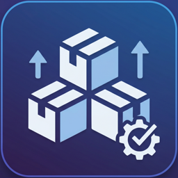

# Modulist

  

  

**Modulist** は、Visual Studio Code に直接統合された、強力で軽量な NPM パッケージマネージャーです。直感的なアクティビティバーとリッチなホバーツールチップにより、依存関係の管理、アップデート、削除を劇的にシンプルにします。

## 🌟 主な機能

- **📦 アクティビティバーへの統合**
  VS Code のアクティビティバーから、プロジェクトのパッケージを直接管理できます。基本的な操作のためにターミナルを開く必要はありません。

- **🔍 リッチなツールチップと詳細情報**
  パッケージをホバーするだけで、NPM レジストリから取得した重要な情報を瞬時に確認できます：
  - 最新バージョン、ライセンス、制作者、週間ダウンロード数
  - パッケージの README のインライン表示

- **⚡ バンドルサイズの確認**
  Bundlephobia API を利用し、ミニファイ化および Gzip 圧縮されたパッケージの容量（バンドルサイズ）を自動取得して表示します。

- **🚀 ワンクリック操作**
  ワンクリックでパッケージのアップデートや削除が可能です。（※現在は内部で `pnpm` を使用しています）

- **🌍 多言語対応 (i18n)**
  英語と日本語の表示に標準で完全対応しています。

## ⚙️ 拡張機能の設定

VS Code の設定画面から、以下のカスタマイズが可能です：

* `modulist.showConfirmations`: パッケージのアップデートや削除を行う前に、確認ダイアログを表示します。（デフォルト: `true`）
* `modulist.showBundleSize`: ホバー時のツールチップや出力パネルに、パッケージ容量を表示します。（デフォルト: `true`）
* `modulist.showReadme`: ホバー時のツールチップに、パッケージの README を表示します。（デフォルト: `true`）

## 📝 動作要件

- パッケージの操作（アップデート・削除）を実行するには、お使いの環境に [pnpm](https://pnpm.io/) がグローバルインストールされている必要があります。

## 🐛 既知の問題

- 現在、アップデートと削除のコマンドは `pnpm` 向けに最適化されています。`npm`、`yarn`、`bun` への対応は、今後のアップデートで予定しています。

## 🤝 リリースノート

### 1.0.0
- Modulist の初回リリース！ 🎉